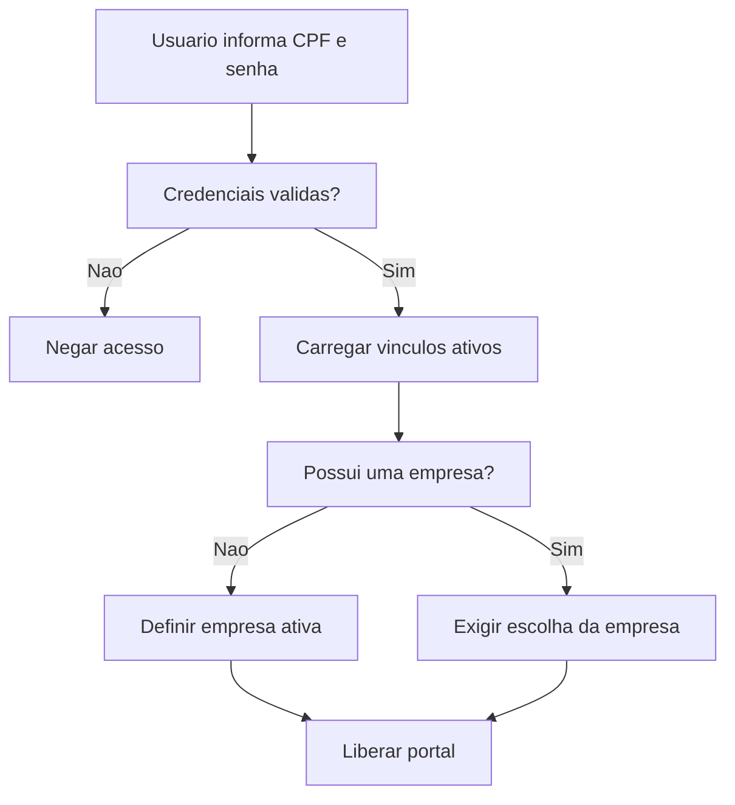

# Fluxo de identidade e acesso

## Objetivo

Definir o fluxo arquitetural da identidade no Fokus Cloud, desde cadastro e login ate selecao de empresa ativa e autorizacao por perfil.

## Conceitos centrais

| Conceito | Responsabilidade |
| --- | --- |
| Usuario global | Representa a pessoa fisica que acessa o ecossistema. |
| Empresa | Representa a organizacao cliente, titular de dados e assinaturas. |
| Vinculo | Liga usuario e empresa, definindo perfil e status. |
| Empresa ativa | Contexto escolhido na sessao para filtrar dados e permissoes. |
| Unidade ativa | Contexto operacional opcional dentro da empresa ativa. |
| Perfil | Papel do usuario dentro de uma empresa especifica. |

## Fluxo de login

## Fluxo de convite

1. Admin ou gestor acessa usuarios dentro do escopo autorizado.
2. Admin ou gestor informa nome, CPF, e-mail e perfil permitido.
3. Sistema verifica se ja existe usuario global com o CPF.
4. Sistema cria ou reaproveita usuario global.
5. Sistema cria vinculo pendente para uma unidade especifica.
6. Sistema envia convite com validade definida.
7. Usuario aceita, cria senha quando necessario e ativa o vinculo.
8. Admin pode adicionar o usuario a outras unidades.

## Fluxo de autorizacao

Toda rota protegida deve validar:

1. usuario autenticado;
2. e-mail confirmado quando o fluxo exigir;
3. empresa ativa;
4. vinculo ativo com a empresa;
5. unidade ativa quando o recurso tiver escopo de unidade;
6. perfil autorizado;
7. permissao especifica do modulo, quando existir.

## Fronteiras de responsabilidade

| Camada | Responsabilidade |
| --- | --- |
| Middleware | Verificar sessao, empresa ativa e vinculo basico. |
| Policy | Autorizar acao sobre entidade ou recurso especifico. |
| Service ou Action | Executar regra de negocio transacional. |
| Controller | Receber requisicao, validar entrada e devolver resposta. |
| Model | Representar entidade, relacionamentos e escopos de dados. |

## Regras arquiteturais

- Produtos derivados nao devem recriar login, empresa ativa ou perfis basicos.
- O modulo de identidade deve expor uma base comum de autorizacao.
- O filtro por empresa deve ser aplicado antes de qualquer consulta sensivel.
- Transferencia de administracao deve ser transacional.
- Estados pendentes, suspensos e removidos devem ser explicitamente representados.
- A suspensao feita por gestor deve atingir apenas a unidade sob sua administracao.
- Alteracoes de acesso devem invalidar ou reavaliar sessoes imediatamente.

## A complementar

- Definir middlewares finais.
- Definir policies por entidade.
- Definir estrutura de actions ou services.
- Definir eventos e listeners de notificacao.
